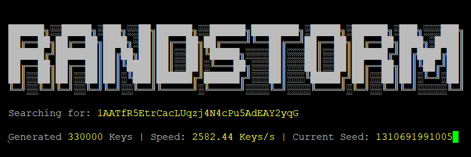

<p align="center">
  
</p>
From 2011 - 2015 many popular exchanges and websites used BitcoinJS to generate Bitcoin wallets. There was an issue with BitcoinJS due to the absence of `window.crypto.random` in many browsers. Consequently, this led to entropy being gathered from `Math.random()`. Using Math.random() for cryptographic key generation should never be done. However, during the 2011-2015 timeframe it was used on all major browsers to generate private keys. <br> <br>

<p align="center">
  
</p>

This means that the Private Key is generated using rng_seed_time() as the only source of entropy. If the address was generated on December 24, 0201, 2:44:56 AM, then using the [Unix epoch time](https://www.epochconverter.com/) we can see that the seed = 55793394904000. This is the Unix epoch time in milliseconds.

## Vulnerable Wallets

This vulnerability is only for wallets that were created using [BitcoinJS-lib v0.1.3](https://cdnjs.cloudflare.com/ajax/libs/bitcoinjs-lib/0.1.3/bitcoinjs-min.js) in the 2011-2015 timeframe. Since we can't determine when the wallet was generated, we can examine when the first transaction took place using the blockchain, using Get_First_Transaction.py we can use an API call from a website such as blockcypher.com:

```bash
Address: 1NUhcfvRthmvrHf1PAJKe5uEzBGK44ASBD
First Transaction: 2014-03-17T07:41:22Z
Current Balance: 1.9999 BTC
```
Convert the date 2014-03-17T07:41:22Z to Unix epoch time in milliseconds: 1395042082000

Now, get the date from whatever time period you want to try before March 3, 2014.

March 1, 2014 = 1393635661000

1395042082000 - 1393635661000 = 1.4 Billion Seeds

## Generate Seeds

Using the implementation of SecureRandom(), set the seed to March 1, 2014 = 1393635661000 and generate keys incrementally until the date of the first transaction:

Seed: 1310691661000 <br>
Hex: 6ad2d763712eae6428e2922d7181f92fb70d0e564d1dd38dd0aa9b34b844c0cb <br>
P2PKH: 1JbryLqejpB17zLDNspRyJwjL5rjXW7gyw<br>

Seed: 1310691661001 <br>
Hex: fb6ad847a48da87b332b565b548347078a1b9890b9c352a4d9993ae09c189fa6 <br>
P2PKH: 1273EG6iByUWoDY8PrCBEhJsEBLEzk1rEi<br>
...

## Download & Installing

```bash
git clone https://github.com/RandstormBTC/randstorm/
cd randstorm
pip install -r requirements.txt
```

Run On Windows (cmd / powershell):
```bash
python randstorm.py
```
Run On Linux (debian):
```bash
python3 randstorm.py
```
## Download Addressess 
All funded Bitcoin addresses can be downloaded at:

http://addresses.loyce.club/

To save all P2P addressess to a file use:
<pre>
grep '^1' Bitcoin_addresses_December_06_2023.txt 
</pre>

Update the file_path in randstorm.py 

## Disclaimer
This software is for education purporses only and should not be configured and used to find (Bitcoin/Altcoin) address hash (RIPEMD-160) collisions and use (steal) credit from third-party (Bitcoin/Altcoin) addresses. This mode might be allowed to recover lost private keys of your own public addresses only.

Another mostly legal use case is a check if the (Bitcoin/Altcoin) addresses hash (RIPEMD-160) is already in use to prevent yourself from a known hash (RIPEMD-160) collision and double use. Some configurations are not allowed in some countries.

## Questions and Comments

Please feel free to share any questions. This is a work in progress and replicating the exact SecureRandom() function in python from Javascript has not been very easy. There still may be some issues...

## Sources:

 <https://www.unciphered.com/blog/randstorm-you-cant-patch-a-house-of-cards>

 <https://jandemooij.nl/blog/math-random-and-32-bit-precision/>

 <https://medium.com/@betable/tifu-by-using-math-random-f1c308c4fd9d>

## Donate:
BTC: bc1q2rqz0mzwxdm0umhlllsyd5rt30uh8kswhqcnqp
