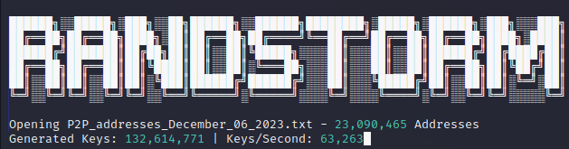
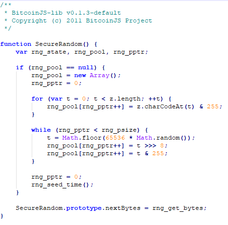

From 2011 - 2015 many popular crypto exchanges used BitcoinJS to generate private keys. There was an issue with BitcoinJS due to the absence of `window.crypto.random` in many browsers. Consequently, this led to entropy being gathered from `Math.random()`. Using Math.random() for cryptographic key generation should never be done. However, during the 2011-2015 timeframe it was used on all major browsers to generate private keys.



This function generates a Random Private Key using the python equivalent to SecureRandom() in BitcoinJS-lib v0.1.3 javascript library with Math.random(). The SecureRandom() uses rng_seed_time() to seed the RNG. This is the [Unix epoch time](https://www.epochconverter.com/) for the time the wallet was created. 

```python
class MathRandomSimulator:
    def __init__(self, psize=32, start_timestamp=1262304000, end_timestamp=1388534399):
        # Initialize the random number generator pool and set the initial state
        self.rng_pool = bytearray()
        self.rng_pptr = 0  # Pointer to the current position in the pool
        self.rng_psize = psize  # Size of the pool

        # Generate a random seed within the specified time range (2010 - 2014) using Unix timestamps
        self._seed = random.randint(start_timestamp, end_timestamp)
        random.seed(self._seed)

    @property
    def seed(self):
        # Get the current seed value used by the random number generator
        return self._seed

    def rng_get_bytes(self, size):
        # Generate and retrieve the next 'size' bytes from the random number generator pool
        while len(self.rng_pool) < size:
            random_value = int(random.random() * (2**32))
            self.rng_pool.extend(random_value.to_bytes(4, 'big'))

        result = bytes(self.rng_pool[:size])
        self.rng_pool = self.rng_pool[size:]  # Remove the bytes that were returned
        return result

```
MathRandomSimulator generates a random seed from 2010 - 2014.

Becuase this algorithm is less secure, it is able to generate keys faster. 

With 6 CPU cores this function generates ~ 1,000,000 Bitcoin HEX private keys / second. 

Compared to more secure bitcoin libraries, such as secrets and os.urandom which generates keys at less than half the speed.  

## Key Generating and Searching Speed

After the HEX key is generated, the string is converted to a Compressed P2PKH Bitcoin address in thie following format:

<pre>
    Hex: a47293a192b48f54eec6ba44e5953ca842bd0d50df5ba4a29ff02dd511a43925
    P2P: 1KM7gf1PF1Ymg6heiDnQDqvT4wcYwGjAgM
</pre>

The P2PKH address generation has been optimized to use the coincurve library for very fast key generation.

The program uses multiprocessing to utilize all avaiable cores.

Addresses to be searched are loaded into RAM using mmap. 

Only the compressed P2PKH is generated, which accounts for the majority of bitcoin wallets. 

With 6 cores it generates ~ 70,000 Keys / second and searches 23,000,000 Addresses / second, or 5.729 billion keys / day.

## Download & Installing

```bash
git clone https://github.com/RandstormBTC/randstorm/
cd randstorm
pip install -r requirements.txt
```

Run On Windows (cmd / powershell):
```bash
python randstorm.py
```
Run On Linux (debian):
```bash
python3 randstorm.py
```
## Download Addressess 
You can implement a function to generate Addressess and check the Balance if you want to spend $10,000 in API calls... 

Here is a good list: 

[42,000 dormant bitcoin addresses](https://steemit.com/dormant/@rogerripple/42-000-dormant-bitcoin-addresses)

Or you can find an updated List of all funded Bitcoin addresses at:

http://addresses.loyce.club/

To save all P2P addressess to a file use:
<pre>
grep '^1' Bitcoin_addresses_December_06_2023.txt 
</pre>

Update the file_path in randstorm.py 

## Disclaimer
This software is for education purporses only and should not be configured and used to find (Bitcoin/Altcoin) address hash (RIPEMD-160) collisions and use (steal) credit from third-party (Bitcoin/Altcoin) addresses. This mode might be allowed to recover lost private keys of your own public addresses only.

Another mostly legal use case is a check if the (Bitcoin/Altcoin) addresses hash (RIPEMD-160) is already in use to prevent yourself from a known hash (RIPEMD-160) collision and double use. Some configurations are not allowed in some countries.

## Sources:

 <https://www.unciphered.com/blog/randstorm-you-cant-patch-a-house-of-cards>

 <https://jandemooij.nl/blog/math-random-and-32-bit-precision/>

 <https://medium.com/@betable/tifu-by-using-math-random-f1c308c4fd9d>

## Donate:
BTC: bc1q2rqz0mzwxdm0umhlllsyd5rt30uh8kswhqcnqp
