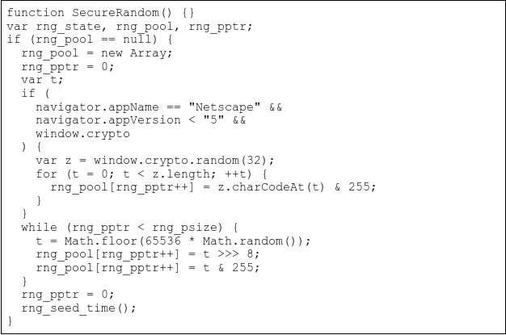

# Randstorm

[](https://opensource.org/licenses/MIT)

## Description
From 2011 - 2015 many popular crypto exchanges used BitcoinJS to generate private keys. 

For an incredibly popular library, there was an issue in BitcoinJS:

“The most common variations of the library attempts to collect entropy
from window.crypto's CSPRNG, but due to a type error in a comparison
this function is silently stepped over without failing. Entropy is
subsequently gathered from math.Random (a 48bit linear congruential
generator, seeded by the time in some browsers), and a single
execution of a medium resolution timer. In some known configurations
this system has substantially less than 48 bits of entropy.”

This program generates a Random Private Key using the python equivalent to SecureRandom() in JSBN javascript library with Math.random(). 



Rather than using the more secure libraries to generate private keys, this private key generator function emulates the weak private key generation used in the JSBN library from 2011 - 2015:

```python
class MathRandomSimulator:
    # Equivalent to SecureRandom() used in JSBN javascript library with Math.random()
    def __init__(self, psize=32):
        self.rng_pool = bytearray()
        self.rng_pptr = 0
        self.rng_psize = psize
        
        while len(self.rng_pool) < self.rng_psize:
            t = int(random.random() * 65536) 
            self.rng_pool.extend(t.to_bytes(2, 'big'))

        self.rng_pptr = 0

    def next_bytes(self, size):
        return self.rng_get_bytes(size)

    def rng_get_bytes(self, size):
        result = bytes(self.rng_pool[self.rng_pptr:self.rng_pptr + size])
        self.rng_pptr += size
        return result
```

The HEX string is created from MathRandomSimulator and converted to a P2P Bitcoin address in thie following format:


<pre>
    Hex: f4389d0921ead29f272294ea790cf4112140e86e347d1933fc302373fb451bdc
    P2P: 1FaVN8XPyNHchgkNRZMwBQGqTMf531yebX
</pre>

## Table of Contents

- [Installation](#installation)
- [Usage](#usage)
- [Contributing](#contributing)
- [License](#license)
- [Contact](#contact)

## Installation

Provide step-by-step instructions on how to install your project. You can include code snippets or commands if necessary.

```bash
npm install
